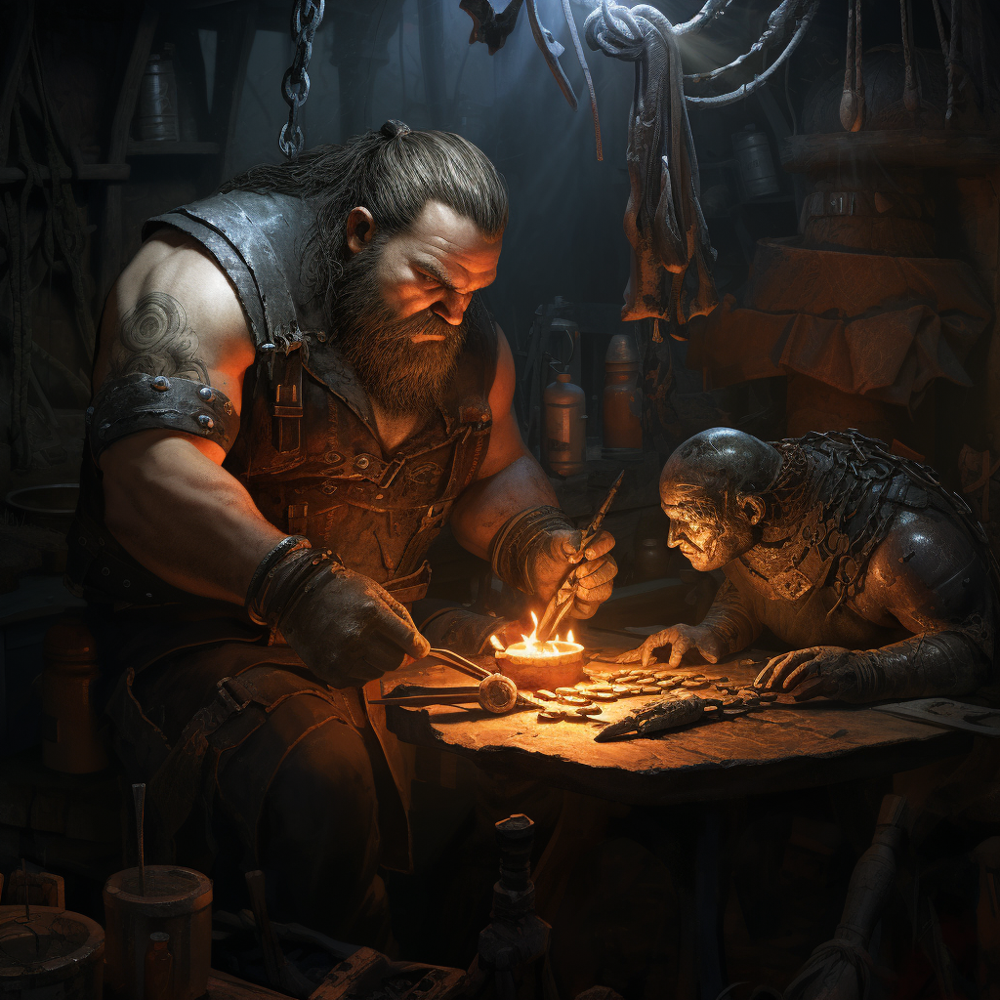

<h1>Crafting Alias</h1>

Alias that handles the main functions of starting and continuing crafting sessions.

## Help:
`!craft <item_name> <item_category> <item_type/cost> <-s skill> <-b #> <eadv/adv/dis> <-i>`

- `item_name*`: Name of the item being crafted. Reminder: Use quotation marks for multi-word items.
- `item_category*`: Name of the category.
- `item_type/cost*`: If the category selected is not a cost-based category, name of the type. Otherwise, cost of the item.
- `-s skill_name`: - `-s skill_name`: This tells the crafting alias to use a skill modifier of the name given. (This is retained item to item, `-s ""` to clear skill)
- `eadv/adv/dis`: Applies double advantage/advantage/disadvantage.
- `-i`: Ignores training cooldown (DO NOT USE EXCEPT WHEN TOLD BY AN ADMIN).
- `-succ*`: Success multiplier (multiplies the number of successes by this)

*Only is used when starting to craft a new item